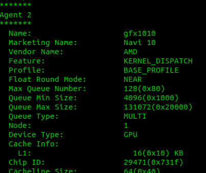

### MyROCm
This repo provide MyROCm binary build and installation guide.

#### Why MyROCm
Official rocm release lack the support for new hardware like Navi.

#### Dependancy
MyROCm running on  ubuntu 19.10 + ( linux kernel 5.3+ ).  or linux environment with kernel > 5.3 and gcc > 9.2.1

#### Lastest update
MyROCm lateest release v3.0 is base on office rocm 3.0.6 with Navi support. This lite version is a focus on HCC and HIP compiler function, and removed other addon component.
With linux kernel 5.4+ ( after the golden register patch ), there are 20% performence gain on Navi GPU.

#### Changes from official ROCM

Few changes made for navi10, include components:

 * Clang,Hcc,Hip,Hsa Rumtime,Roct 

#### Installation guide.

 * Prepare your ubuntu 19.10 environment.
Hint1:  check all kernel driver was properly loaded.

```
dmesg | grep amdgpu
dmesg | grep kfd
```

Hint2:  add your user to 'render' ( or 'video' ) group before you try rocm.

Hint3:  install maybe missing system library.

```
sudo apt install libtinfo6 libboost-all-dev libz3-4
```


 * Download MyROCm from:

https://github.com/smartbitcoin/MyROCm/releases/download/3.0_navi10/myrocm.3.0.tar.bz2

```
 cd /opt
 tar xvf myrocm.3.0.tar.bz2
```

 * Config ROCm library path.
 
 ```
 sudo touch /etc/ld.so.conf.d/rocm.conf
 ```
 
 and put following two line into rocm.conf
 
 ```
 /opt/rocm/lib
 /opt/rocm/hsa/lib
 /opt/rocm/hcc/lib
 ```
 
  * Try it out.
  
  check your navi was found:
  
  /opt/rocm/bin/rocminfo
  
  
   
  /opt/rocm/bin/hipInfo
  
  
  
  test the hip sample
  
  ```
  cd /opt/rocm/hip/samples/0_Intro/bit_extract
  make
  ./bit_extract
  ```
  
#### Known issue
 * libhsa-ext-image64.so is propertory code and current binary have no navi support from amd yet.  texture related api will fail.
 * In some x570 motherboard ( at least msi x570-a),  if running two rx5700 set,  the hip application maybe hang up.
 
  
  
  
[]()
